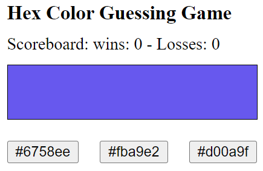
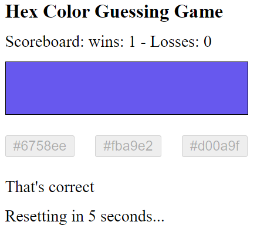
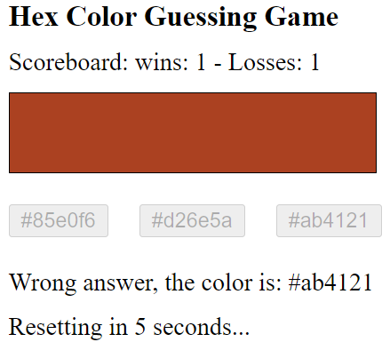

[](https://classroom.github.com/open-in-codespaces?assignment_repo_id=9205996)
# CS569-Hex Color Guessing Game
Welcome to the first workshop in the CS569 course. We are going to build a HEX color guessing game!  
  
This is a competitive individual workshop, and should not be worked in groups, at 2:00 PM, when we meet again to code the solution together, we will randomly pick 3 students who submit a correct solution before 12:30 PM (including the extra requirements), these students will have one extra day to work and submit their final project! Good luck to everyone, and happy coding!  
  
If you pushed your code before 12:30 PM, send me a text message on Teams so I could check your code immediately and determine your eligibility for the final project advantage selection.  
  
## Game specifications
In this game users will have to guess the displayed color from 3 buttons as shown below:
<p align="center">
  
</p>
  
Once the user clicks on the answer:  
* All buttons are disabled.  
* A message is displayed with: "That's Correct!" Or "Wrong answer, the color is: #RRGGBB".   
* Change the scoreboard state.
* Display an interval countdown from 5 to 0 seconds and reset the game once it reaches 0 (Reset: pick a new color, activate buttons, remove all messages) as displayed below:  
  
<p align="center">
  
  
</p>
  
## Extra requirements
1. Create a directive `CheatDirective`, that listens to its host element (color div) for double-click event, and displays the HEX color value as alert.
2. Persist the scoreboard state in the `localStorage` object and retrieve it when the app reloads.
  
## Code assistance
Use the code below to generate a random HEX color value, and to pick one random value from a given array:
```js
  private generateRandomHexColor(): string {
    return '#' + (Math.random() * 0xFFFFFF << 0).toString(16).padStart(6, '0');
  }
  
  private getRandomItemFromArray(arr: string[]): string {
    return arr[Math.floor(Math.random() * arr.length)];
  }
```
### Code Honor Submission Policy
*Remember to respect the code honor submission policy. All written code must be original. Presenting any code as one’s own work when it came from another source is plagiarism, that includes any matching patterns and code snippets, and will result in not being part of the final project advantage selection, and potentionally affect your homework grade.*
