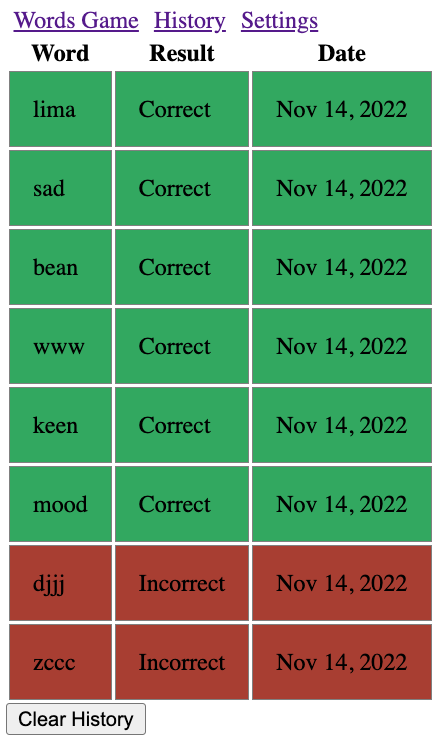
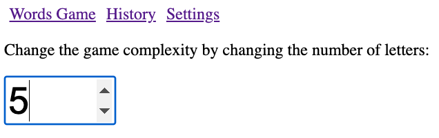

[](https://classroom.github.com/open-in-codespaces?assignment_repo_id=9329392)
# CS569 - Words Game
You will be building a Word Gessing game with Angular Framework. Please refer to the demo for how the game works.  
    
### Backend Preparation
To start, download the provided code for the backend server, install the dependencies, get your API key from [Oxford Dictionaties API](https://developer.oxforddictionaries.com/) and choose the free introductory package. Update your `config.json` file with the your application ID and Key.
```json
{
    "app_id": "INSERT_YOUR_APP_ID_HERE",
    "app_key": "INSERT_YOUR_APP_KEY_HERE"
}
```
Start your backend server `npx nodemon app.js` and make sure it is listening to port `3000`. This web server accepts requests to `GET /check/:word` and returns the following response `{valid: boolean}` which indiciates whether the provided word is valid or not.
  
### Frontend Development
Create an Angular project that routes the following components:
* `WordsComponent`
* `HistoryComponent`
* `SettingsComponent`
  
All three components share one reactive global state in a form of `BehaviorSubject`, which is always synched with `localStorage`. The state has the following structure and default value:
```ts
export enum GUESS_RESULT {
    Correct = "Correct",
    Incorrect = "Incorrect"
}

export interface ITry {
    word: string
    result: GUESS_RESULT
    timestamp: number
}

export interface IState {
    complexity: number
    win_count: number
    loss_count: number
    logs: ITry[]
}

export const INITIAL_STATE = {
    complexity: 5,
    win_count: 0,
    loss_count: 0,
    logs: []
}
```
#### `WordsComponent`
* The `WordsComponent` show the scoreboard win and loss counts from the state.
* A placeholder for the answer:
    * A button to clear the answer. 
    * When any letter is clicked, the letter will be removed.
* Button Controls: "Shuffle" + (Letters * complexity) + "Check". 
    * The "Shuffle" button would select a new set of random letters without affecting the scoreboard (refer to the method below). 
    * The number of letters buttons is based on the game complexity. 
    * The "Check" button would send a request to the backend server and verify the selected word, which will affect the scoreboard and logs the results to the state.
<p align="center">
  
</p>

The following helper method returns an array of unique random letters, where length is the game complexity:
```ts
  private getRandomLettersArrayOf(length: number): string[] {
    let result: string[] = [];
    const characters = 'ABCDEFGHIJKLMNOPQRSTUVWXYZ';
    while (result.length < length) {
      const letter = characters.charAt(Math.floor(Math.random() * characters.length))
      if (!result.includes(letter)) result.push(letter)
    }
    return result;
  }
```
#### `HistoryComponent`
This component shows the state `logs`. A color directive is applied on each log to change its background color to red/green based on the result.
<p align="center">
  
</p>
  
#### `SettingsComponent`
This components changes the game complexity to display different number of letter-buttons. The complexity must be a value between 3 and 26, an error must be displayed when the value is outside of that range.
<p align="center">
  
</p>

### Notes
* All students will submit their work by 1:00 PM, regardless if they finished or not.
* Completing the requirement will provide immunity in the final exam in three tiers:
  * Full implementation: You may wave questions up to 20 points from the final exam. (tier capacity: 3 students)
  * (Words and History) or (Words and Settings): You may wave questions up to 15 points from the final exam.  (tier capacity: 3 students)
  * Words only: You may wave questions up to 5 points from the final exam. (no capacity)
* All students will send me a message on Teams and specify which tier they are applying to.

  
### Code Honor Submission Policy
*Remember to respect the code honor submission policy. All written code must be original. Presenting any code as one’s own work when it came from another source is plagiarism, that includes any matching patterns and code snippets, and will result in not being part of the final project advantage selection, and potentionally affect your homework grade.*
